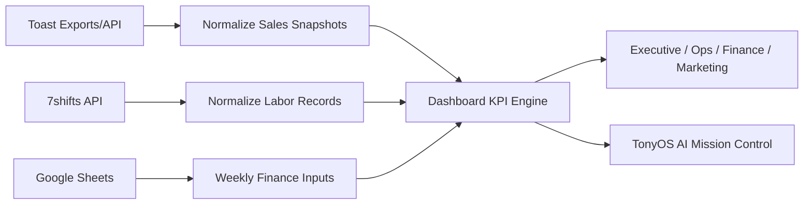

# Restaurant KPI & AI Operations Command Center

Resume-safe public version of a multi-location restaurant KPI dashboard and AI operations monitor.

All data in this repository is synthetic. The production project uses private Toast exports, 7shifts labor data, and Google Sheets finance inputs, but those source files, IDs, credentials, and operational numbers are intentionally excluded here.

## What This Demonstrates

- Multi-location executive KPI dashboards
- Toast-style sales export ingestion with validated snapshots
- 7shifts-style labor sync design for actual worked labor
- Google Sheets-style weekly prime cost inputs
- Period-aware reporting: This Week So Far, Single Day, Last Week, Last Month, Last Year, and Custom Range
- Safe KPI rules: never invent missing values, show `TBD` when source data is missing or mismatched
- TonyOS AI Mission Control for QA status, pipeline health, logs, recommendations, and supervised agent actions
- Vercel-ready backend route structure with secrets kept server-side

## Source Of Truth Rules

- Sales and revenue: Toast exports or Toast API
- Labor cost and labor hours: 7shifts actual labor
- Food cost and prime cost inputs: CEO-approved weekly Google Sheets
- Prime Cost: only calculated when sales, labor, and food cost match the same selected period

## Local Preview

This demo is static and can run with any simple web server:

```sh
python3 -m http.server 8080
```

Then open:

```text
http://localhost:8080
```

## Public Safety

Before making a repo public, run:

```sh
scripts/check_public_safety.sh
```

The checker looks for common secret patterns and accidental private data folders.

## Production Architecture




